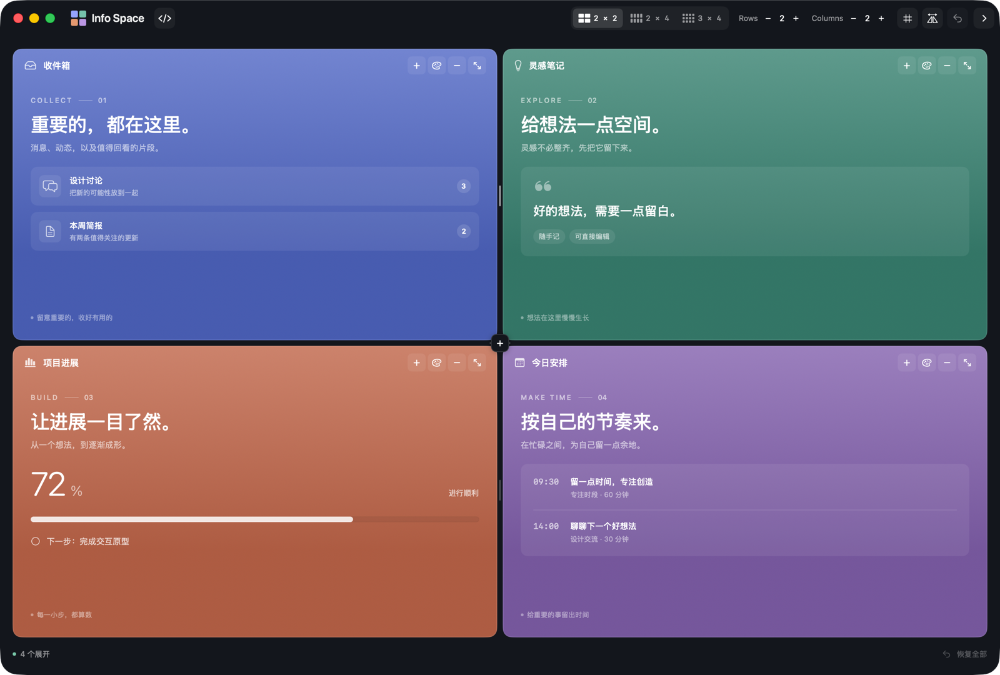

<p align="center">
  
</p>
<h1 align="center">Info Space</h1>
<p align="center"><strong>A native SwiftUI information workspace and embeddable SDK for macOS</strong><br>Organize panels · Resize layouts · Customize your workspace</p>

<p align="center">
  <a href="https://github.com/nocoo/infospace/releases"></a>
  
  
  
  
  <a href="https://github.com/nocoo/infospace/actions/workflows/ci.yml"></a>
  <a href="../LICENSE"></a>
</p>
<p align="center"><a href="../README.md">中文</a> · <a href="API.md">SDK guide</a> · <a href="https://github.com/nocoo/infospace/releases">Releases</a></p>
<p align="center"></p>

---

## What is this?

Info Space arranges multiple information panels in one macOS workspace. Drag a divider or an intersection to change the proportions: movement follows the pointer continuously, then snaps to the nearest grid tick on release.

The repository contains a Swift package and a demo app. Embed a grid in an existing SwiftUI view, or compose a complete workspace with a native window and your own toolbar. Layout state is separate from the UI; your application supplies panel content and colors.

## Features

- **Grid layouts** — Configure 1–8 rows and 1–8 columns on a 32 × 32 grid. Drag each divider independently or move both axes together at an intersection.
- **Maximize and minimize** — Maximizing a panel keeps the others as colored banners with horizontal titles. Minimize individual panels and click their banners to restore them.
- **Layout APIs** — Insert an animated space at a specified cell, move or remove spaces, and set proportions. Stable IDs preserve content identity.
- **Custom panels** — Supply colors, content and extra actions. Panel headers retain their icon, title and fixed minimize/maximize buttons.
- **Replaceable components** — Customize banners, vacant cells, overlays and divider appearance, or embed just the grid.
- **Native window** — Share one header row with the traffic lights. Add up to three actions or links beside the brand and animate the layout controls closed.
- **Surrounding regions** — Insert SwiftUI views above, below or beside the grid. The footer has independent leading and trailing slots; either can be empty.
- **Native interaction** — Keyboard controls, accessibility labels and Reduce Motion support, with no third-party runtime dependencies.

## Installation

Requires macOS 26+, Swift 6.3 and Xcode 26.6+. In Xcode, add `https://github.com/nocoo/infospace` and select the `InfoSpaceCore` and `InfoSpaceUI` library products.

For a Swift package, declare the dependency:

```swift
.package(url: "https://github.com/nocoo/infospace.git", from: "0.1.0")
```

Add the products to your target:

```swift
.product(name: "InfoSpaceCore", package: "infospace"),
.product(name: "InfoSpaceUI", package: "infospace")
```

A minimal grid:

```swift
import InfoSpaceCore
import InfoSpaceUI
import SwiftUI

struct MyGrid: View {
    @State private var model = InfoSpaceModel(rows: 2, columns: 2)

    var body: some View {
        InfoSpaceCanvas(model: model, appearance: { identity in
            SpaceAppearance(title: identity.rawValue, symbol: "doc.text", color: .indigo)
        }) { identity in
            Text("Content for \(identity.rawValue)")
        }
    }
}
```

`InfoSpaceCanvas` imposes no window minimum size and fits inside any SwiftUI layout. Use `InfoSpaceWorkspace` for a full workspace and `InfoSpaceWindow` for a native window. See the [compiled examples](../Examples) and [SDK guide](API.md) for more options.

v0.1.0 distributes the Swift package and source. Build the demo locally using the development steps below.

## Commands

These keyboard shortcuts are provided by the demo app:

| Shortcut | Action |
| --- | --- |
| `⌘G` | Show or hide the grid |
| `⌘0` | Balance rows and columns |
| `⇧⌘0` | Restore all spaces |
| `⌘1` / `⌘2` / `⌘3` | Select a 2 × 2, 2 × 4 or 3 × 4 layout |
| `Esc` | Leave maximize mode |

The `+` action in a panel inserts a space at that cell; the palette button changes its color. The header's code button opens GitHub, and the right arrow collapses the layout controls. The footer shows panel counts on the left and a restore-all action on the right.

## Project structure

```text
infospace/
├── App/                    # Native macOS demo and window inspection
├── Sources/
│   ├── InfoSpaceCore/      # Layout, stable IDs, proportions and snapping
│   └── InfoSpaceUI/        # SwiftUI grid, panels and window components
├── Tests/
│   └── InfoSpaceCoreTests/ # Layout and interaction-state unit tests
├── Examples/               # Examples compiled as SDK consumers
├── docs/                   # SDK guide, English README and screenshots
├── scripts/                # Build, lint, checks and version validation
├── Package.swift           # Swift package products and targets
├── package.json            # Release version metadata
└── project.yml             # XcodeGen app configuration
```

## Technology

| Layer | Technology |
| --- | --- |
| UI | [SwiftUI](https://developer.apple.com/xcode/swiftui/) |
| Native window | [AppKit](https://developer.apple.com/documentation/appkit) |
| State and concurrency | [Observation](https://developer.apple.com/documentation/observation), Swift 6 |
| Package and app builds | [Swift Package Manager](https://www.swift.org/documentation/package-manager/), [XcodeGen](https://github.com/yonaskolb/XcodeGen) |
| Testing | [Swift Testing](https://github.com/swiftlang/swift-testing), native window event inspection |
| Code checks | [SwiftLint](https://github.com/realm/SwiftLint), [swift-format](https://github.com/swiftlang/swift-format) |

## Development

Install full Xcode and complete its first-launch setup, then build from source:

```sh
git clone https://github.com/nocoo/infospace.git
cd infospace
brew install xcodegen swiftlint
./scripts/build.sh -quiet
./scripts/run.sh
```

Scripts default to `/Applications/Xcode.app/Contents/Developer`; set `DEVELOPER_DIR` to use another Xcode installation. The window opens centered at 92% of the screen's available width and 90% of its height. Demo notes are editable; content and layout are not persisted between launches.

| Command | Purpose |
| --- | --- |
| `./scripts/build.sh -quiet` | Generate the Xcode project and build the native app |
| `./scripts/run.sh` | Open the demo window |
| `./scripts/format.sh` | Apply Swift formatting |
| `./scripts/lint.sh` | Run strict SwiftLint and swift-format checks |
| `./scripts/check.sh` | Validate versions, run tests, compile examples and build Release |
| `python3 scripts/verify-ui.py` | Inspect the native window in a logged-in macOS desktop session |
| `python3 scripts/version.py --sync` | Synchronize the macOS app version from release metadata |

The root `package.json` contains release metadata only and adds no JavaScript runtime requirement. `Package.swift` manages Swift builds and dependencies. See [contributing](../CONTRIBUTING.md) for version synchronization and release steps.

## Testing

| Layer | Coverage | When it runs |
| --- | --- | --- |
| Static checks | Strict SwiftLint, swift-format and version consistency | Locally and in GitHub Actions |
| Unit tests | Insertion, movement, collisions, rollback, proportions, snapping and sparse layouts | Locally and in GitHub Actions |
| SDK examples | Embedded grid, customized workspace and full window consumers | Locally and in GitHub Actions |
| App builds | Swift Release and native Debug bundle | Locally and in GitHub Actions |
| Native window | Buttons, dragging, release snapping, footer, toolbar and retained content state | Separately on a local desktop |

```sh
./scripts/check.sh
./scripts/build.sh -quiet
python3 scripts/verify-ui.py
```

v0.1.0 includes 51 unit tests and 36 native window checks. Layout tests cover all 4,096 minimization patterns of a twelve-panel grid. Window inspection sends events to and captures only its own window, writing reports to the Git-ignored `.local/inspections/` directory. It is not system Accessibility E2E testing and does not run in headless CI.

Content resizes live during dragging; snapshot freezing is not implemented. Geometry benchmarks exclude SwiftUI layout and rendering time.

## Documentation

| Document | Contents |
| --- | --- |
| [SDK guide](API.md) | Containers, slots, appearance, actions and mutation semantics |
| [Examples](../Examples) | Embedded grid, custom regions and native window |
| [Contributing](../CONTRIBUTING.md) | Development, validation and release workflow |
| [Changelog](../CHANGELOG.md) | Changes by version |
| [中文 README](../README.md) | Chinese documentation |

## License

[MIT](../LICENSE) © 2026 NOCOO
